# consultas_1_sql
# introductorio a la consulta de una base de datos usando el lenguaje SQL

## base de datos: ventas 

# tabla: clientes

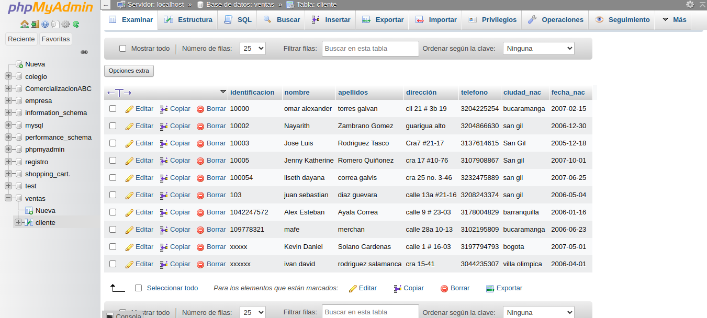

## instruccion SELECT

- permite seleccionar datos de una tabla
- su formato es : "SELECT campos tabla FROM nombre tabla"

## consulta No . 1
1. para visualizar la informacion que contiene  la tabla cliente se puede incluir con la instruccion SELECT el caracter **\*** o cada uno de los campo de las tablas 

- ´SELECT * FROM clientes´

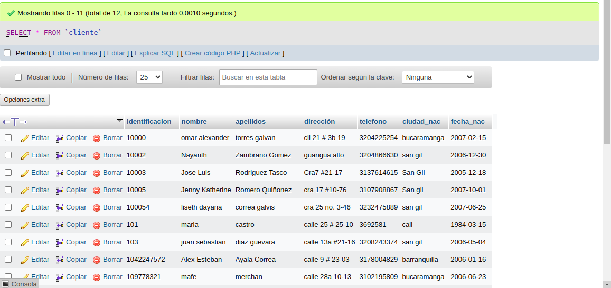

- ´ŚELECT identificacion, nombre, apellidos, dirreccion, telefono, ciudad nac, fecha nac FROM cliente´

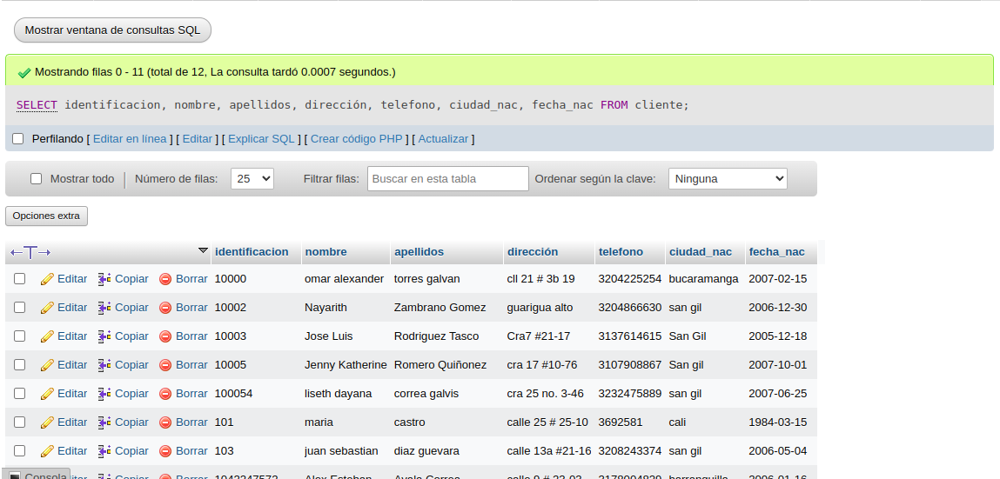

### consulta No .2
para visualizar solamente la identificacion de cliente 

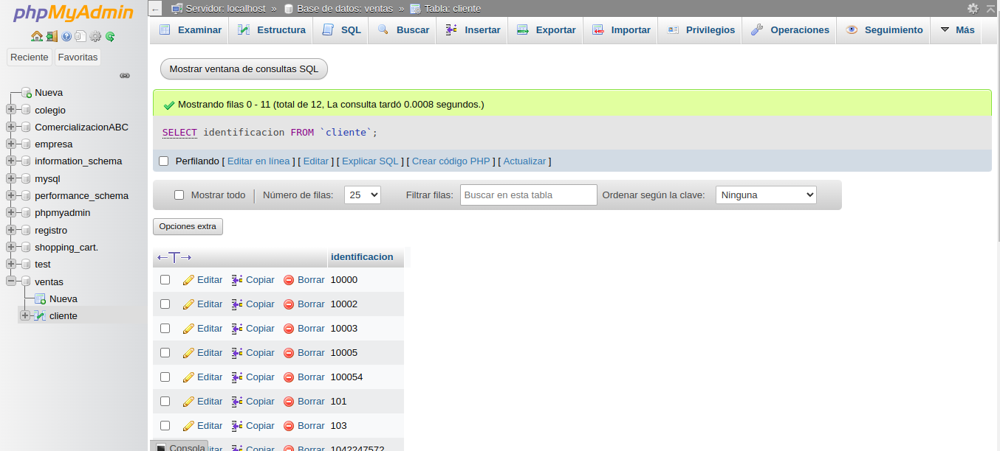
### consulta No. 3
si se desea obtener los registros cua identificacion sea mayor o igual a 150, se debe utilizar la clasula (WHERE) que especifica las condiciones que debe reunir los registros que se van seleccionando 
´SELECT * FROM cliente WHERE identificacion>=150´

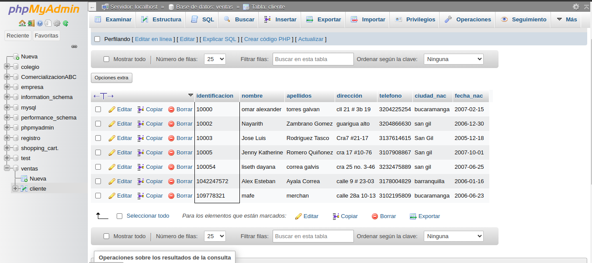

### consulta No. 4

se desea obener los registros cuyo apellidos sean vanega o cetina, se debe utilizar el operados "IN" que especifica los registros que se quieren visualizar de una tabla 

SELECT apellidos FROM `clientes` WHERE apellidos IN ('vanegas', 'cetina')

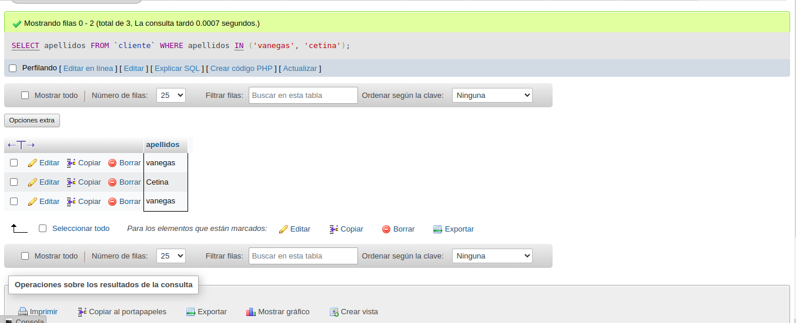

o se puede utilizar

SELECT apellidos FROM `clientes` WHERE apellidos ='vanegas' OR apellidos = 'cetina'

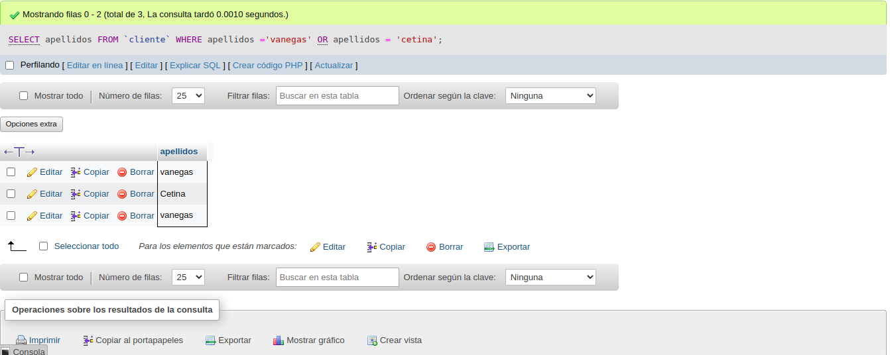

### consulta No .5
se desea obtener los registros cuya identificacion sea menor de 110 y la ciudad sea cali debe utilizar el operador "AND"

´SELECT * FROM cliente WHERE identificacion<=110 AND ciudad_nac = ´cali´´

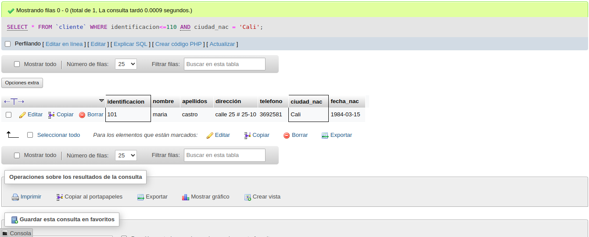

### consulta No .6
si se desea obtener os registros cuyo nombres empiecen por la letra A, se debe utilizar el operador `LIKE` que utiliza los patrones `%` (todos) y `_` (caracter)

`SELECT * FROM clientes WHERE nombre LIKE 'a%'`

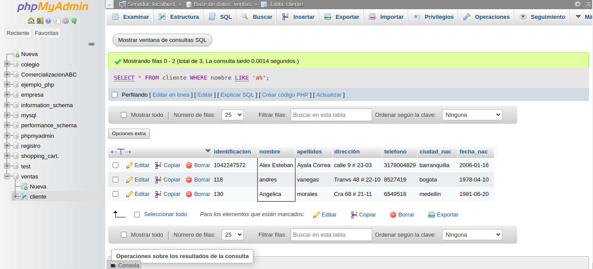

### consulta 7
7. se desea obtener los registros cuyos nombres contengan la letra '2'

`SELECT * FROM clientes WHERE nombre LIKE 'a%' `

### consulta 8
se desea obtener los registros donde la cuarta letra del nombre del cliente sea la letra `a`

`SELECT * FROM clientes WHERE nombre LIKE '___a' `

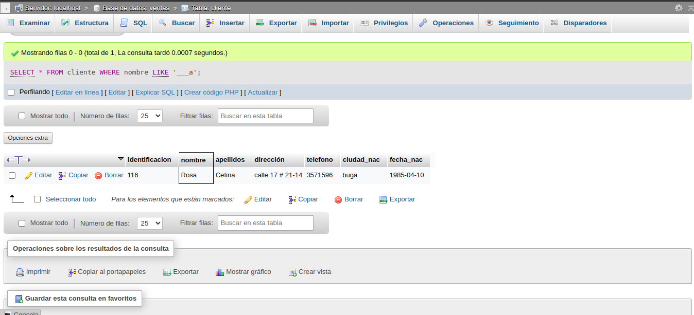

### consulta 9
si se desea obtener los registros cuya identificacion este entre el intervalo 110 y 150, se debe utilizar la clasula `BETWEEN`, que sirve para especificar un intervalo de valores 

 `SELECT * FROM clientes WHERE identificacion BETWEEN 110 AND 150' `

 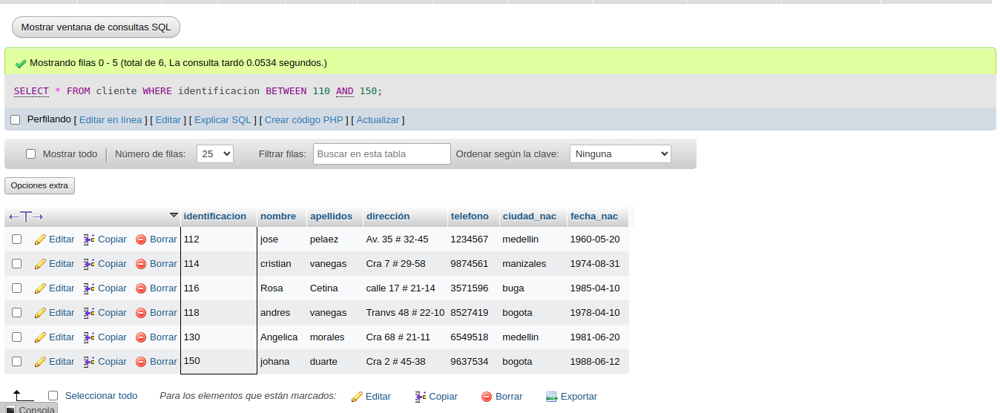

 ## introduccion DELETE
 - permite borrar todos o un grupo especifico de registros de un tabla
 - su formato es: `DELETE nombre_tabla`

 ### eliminacion .1

 eliminar los rgistros cuya identififcacion sea mayor a 170
 
 `DELETE FROM cliente WHERE identificacion > 170`

  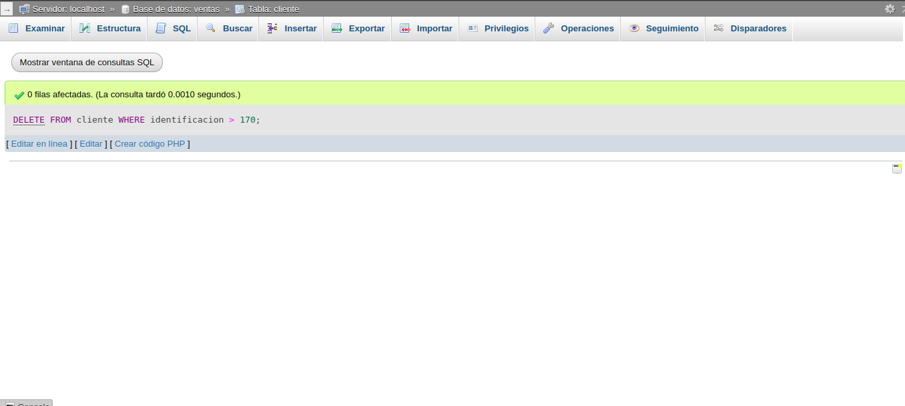

  ### eliminar 2

  eliminar los registros cuyos identificacion sea igual a 116

   `DELETE FROM cliente WHERE identificacion = 116`

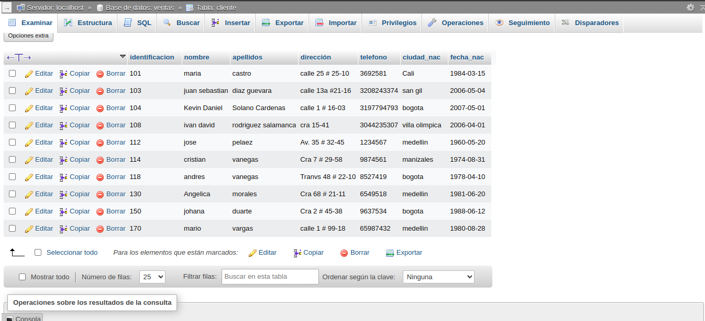

## introduccion UPDATE
 - permite actualizar un campo de una tabla
 - su formato es: `update nombre_tabla SET nombre_campo = valor`

 ### actualizcion No .1

para actualizar la ciudad de nacimiento de cristian vanegas, cuya identificacion es 114

`update cliente SET ciudad_nac = 'pereira' WHERE identificacion=114`

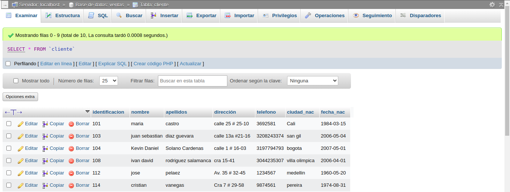

